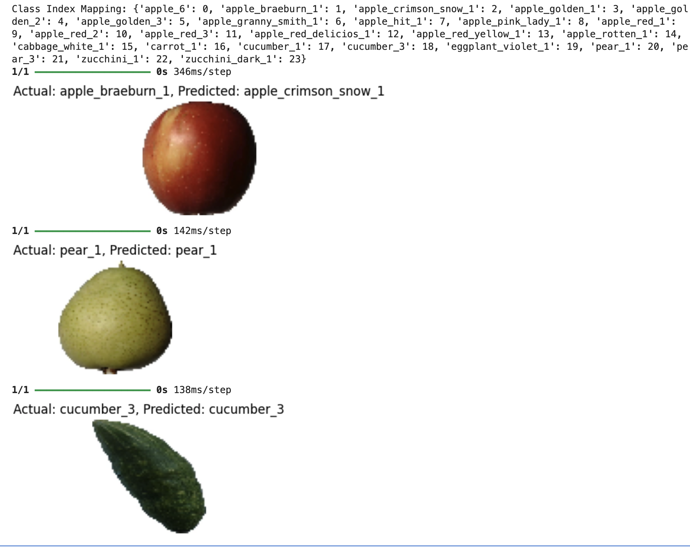

# 🍎 Fruit Image Classification using Transfer Learning (VGG16)

## 📌 Overview
This project builds an end-to-end deep learning image classification model using transfer learning with VGG16. The goal was to classify different types of fruits from images while demonstrating strong generalization and efficient training.

---

## 🎯 Objective
- Classify fruit images into multiple categories
- Leverage pre-trained models to improve performance
- Apply fine-tuning to enhance task-specific learning
- Evaluate model performance on unseen data

---

## 🧠 Approach

### 1. Data Preprocessing
- Resized images to a fixed input size (64x64)
- Normalized pixel values (0–255 → 0–1)
- Used data generators for efficient loading

### 2. Data Augmentation
- Applied transformations such as rotation, zoom, and flipping
- Improved model generalization and robustness

### 3. Transfer Learning (VGG16)
- Loaded pre-trained VGG16 model (ImageNet weights)
- Froze base layers to retain learned features
- Added custom classification layers on top

### 4. Initial Training
- Trained only the top layers
- Established baseline performance

### 5. Fine-Tuning
- Unfroze top layers of VGG16
- Allowed learning of task-specific features
- Used a lower learning rate for stability

### 6. Optimization Techniques
- Early Stopping → prevented overfitting
- Learning Rate Scheduling → improved convergence

---

## 📊 Results

- **Test Accuracy:** ~91%
- Strong alignment between validation and test performance
- Minimal overfitting observed

---

## 📈 Model Performance

### Accuracy Trends
- Training and validation accuracy improved steadily
- Significant performance boost after fine-tuning

### Loss Trends
- Both training and validation loss decreased consistently
- No divergence → stable learning

---

## 🔍 Prediction Insights

- Model correctly classified most images
- Minor errors occurred between visually similar classes (e.g., different apple varieties)
- Indicates strong high-level feature learning with slight fine-grained limitations

---

## 🧠 Key Learnings

- Transfer learning significantly reduces training time and improves performance
- Fine-tuning enhances model adaptability to specific tasks
- Monitoring validation metrics is critical for detecting overfitting
- Visualizing predictions provides deeper insight into model behavior

---

## 🛠️ Tech Stack

- Python
- TensorFlow / Keras
- NumPy
- Matplotlib

---

## 🚀 Future Improvements

- Increase image resolution for better fine-grained classification
- Use more advanced architectures (e.g., EfficientNet, ResNet)
- Expand dataset for improved generalization
- Apply class balancing techniques if needed

---

## 📊 Results

- Achieved ~91% accuracy on unseen test data
- Demonstrated strong generalization using transfer learning

---

## 🖼️ Sample Predictions

## 💡 Conclusion

This project demonstrates the ability to design, train, fine-tune, and evaluate a deep learning model end-to-end. The model achieved strong performance on unseen data and provided meaningful insights into real-world classification challenges.

---

## 📎 Author

[Todd Coulombe]

Aspiring AI Engineer | Machine Learning | Deep Learning
achieved strong performance on unseen data and provided meaningful insights into real-world classification challenges.

---

## 📎 Author

[Todd Coulombe]

Aspiring AI Engineer | Machine Learning | Deep Learning
